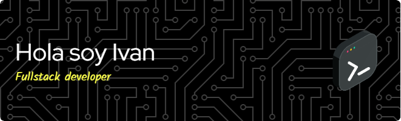

  

<section align="left">

</section>

#### Soy un Desarrollador FullStack responsable y eficiente ✔.
Tengo como objetivo adquirir experiencia, aprender de grandes profesionales, asumir nuevas responsabilidades y crecer como desarrollador.

- 🌱 Estoy aprendiendo Sass, Nextjs, Prisma 
- 👯 Quiero colaborar con Proyectos que me brinden experiencias y ayuden a crecer como Desarrollador 
- 📫 Cómo contactarme: bongiovanniivan12@gmail.com 

<h2 align="left">Tecnologias con las que trabajo !</h2>

<h2 align="left">Conecta conmigo !</h2>

  

