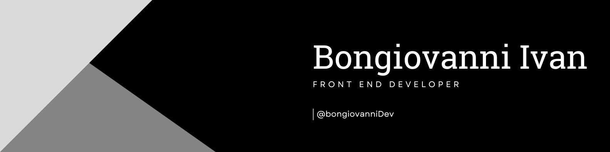

# 👋 ¡Hola! Soy Ivan Bongiovanni

🚀 Desarrollador **Full Stack** con especial interés en el desarrollo frontend. Me apasiona crear soluciones innovadoras y eficientes.  

### 🛠️ Tecnologías y herramientas:  
- **Frontend:** Astro, Next.js, React.js, TailwindCSS, ShadcnUI  
- **Backend:** Node.js, PHP, Prisma ORM, PostgreSQL  
- **DevOps:** Docker  

💡 Apasionado por la **inteligencia artificial** y la innovación tecnológica.  
📚 Siempre en constante aprendizaje y crecimiento profesional.  

🔗 [LinkedIn](https://www.linkedin.com/in/bongiovanni-ivan45/) | 🌐 [Portafolio](https://ivanbong.vercel.app/) | 📫 [Email](bongiovanniivan12@gmail.ccom)  

<h2 align="left">Tecnologias con las que trabajo !</h2>

![Metrics](https://metrics.lecoq.io/ivan2214?template=classic&base.hireable=true&isocalendar=1&languages=1&lines=1&activity=1&notable=1&base=header%2C%20activity%2C%20community%2C%20repositories%2C%20metadata&base.indepth=false&base.hireable=true&base.skip=false&isocalendar=false&isocalendar.duration=full-year&languages=false&languages.limit=8&languages.threshold=0%25&languages.other=false&languages.colors=github&languages.sections=most-used&languages.indepth=false&languages.analysis.timeout=15&languages.analysis.timeout.repositories=7.5&languages.categories=markup%2C%20programming&languages.recent.categories=markup%2C%20programming&languages.recent.load=300&languages.recent.days=14&lines=false&lines.sections=base&lines.repositories.limit=4&lines.history.limit=1&lines.delay=0&notable=false&notable.from=organization&notable.repositories=false&notable.indepth=false&notable.types=commit&notable.self=false&activity=false&activity.limit=5&activity.load=300&activity.days=14&activity.visibility=all&activity.timestamps=false&activity.filter=all&config.timezone=America%2FBuenos_Aires&config.octicon=true)
